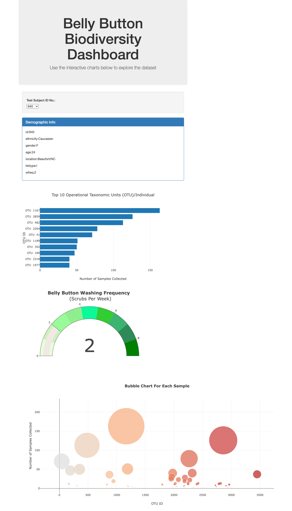

### Interactive Web Visualization : Belly Button Biodiversity

##### In this mini project, an interactive dashboard was build to explore the Belly Button Biodiversity dataset, which    catalogs the microbes that colonize human navels.
##### The dataset reveals that a small handful of microbial species (also called operational taxonomic units, or OTUs, in the study) were present in more than 70% of people, while the rest were relatively rare.

#### Following steps were followed for this work:
* Use the D3 library to read in samples.json.
* Create a horizontal bar chart with a dropdown menu to display the top 10 OTUs found in that individual.
* Create a bubble chart that displays each sample.
* Display the sample metadata, i.e., an individual's demographic information.
* Display each key-value pair from the metadata JSON object somewhere on the page.
* Update all of the plots any time that a new sample is selected.

* Advanced Challenge Assignment (Optional)
   * Adapt the Gauge Chart from https://plot.ly/javascript/gauge-charts/ to plot the weekly washing frequency of the individual.

#### Tools used:
* D3 JS Library
* Plotly JS
* html,css,bootstrap

##### Contact Info
* [Linkedin Link](https://www.linkedin.com/in/tamasree-sinha/)
* email id : tamasree.g@gmail.com

